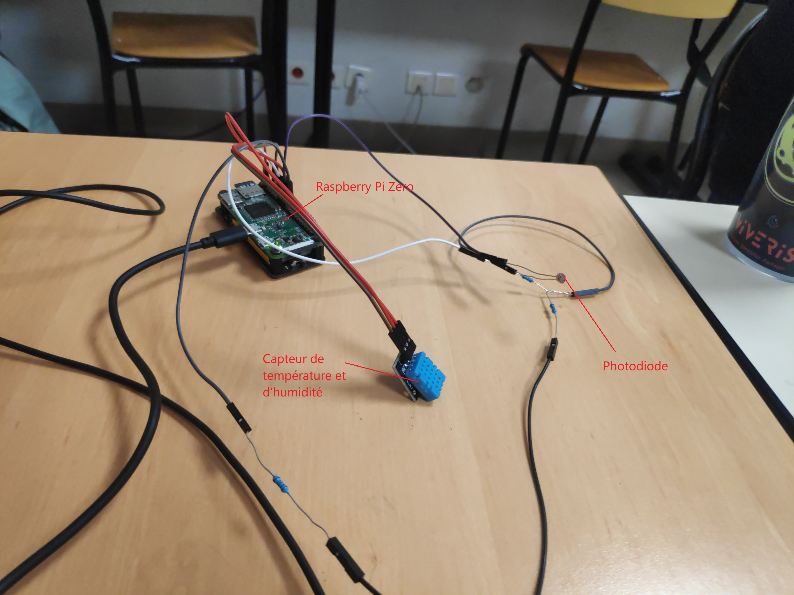
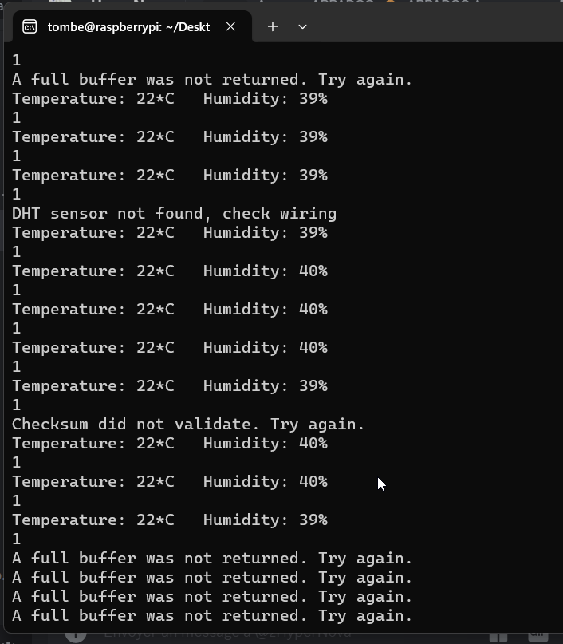

# IoTNuitInfo2023-5plus2egal5

## Présentation

Dans le cadre de la nuit de l'info, nous avons réaliser un système cyber-physique à partir d'une Raspberry Pi Zero. Pour cela nous lui avons ajouter divers capteurs qui lui permettent de mesurer des paramètres physiques comme le taux d'humidités, la température ou encore les gaz.
De plus chacune de nos mesures sont envoyés sur un serveur, grâce à une API Rest, sous token JWT, afin que tout le monde puisse voir les données.
Vous trouverez ici une schéma du système, ainsi qu'une photo de la réalisation.

## Capteurs

### Température

Nous avons grâce à un capteur DTH11, pu récupérer la température de l'environnement qui est directement envoyé à la carte. Ce qui nous permet de surveille cette dernière dans un lieu précis (car les mesures peuvent être géolocalisée - non fait dynamiquement)

### Humidité

Nous avons grâce à un capteur DTH11, pu récupérer l'humidité de l'environnement qui est directement envoyé à la carte. Ce qui nous permet de surveille cette dernière dans un lieu précis (car les mesures peuvent être géolocalisée - non fait dynamiquement)

### Lumière

Nous avons grâce à une photodiode, pu récupérer la lumière ambiante de façon binaire. Tout ca dans le but de vérifier si les mesures sont prises de jours ou de nuits.

### Gaz

Enfin nous aurions voulu, mettre en place un capteur de type MQ-2, afin de pouvoir faire remonter la présence ou non de certain gaz, dans le but de donner un bilan de santé de l'air ambiant. Mais nous avons rencontré des problèmes au niveau électronique, car la raspberry nécéssitait un composant en plus pour pouvoir s'interfacer avec le capteur de gaz, cependant nous n'avons pas pu nous procurer ce composant.

## En fonctionnement

Voici une image du processus de récupération des données en fonctionnement, ainsi qu'un image du dashboard qui permet de les visualiser.

## Objectif

Tous ce système a été mis dans l'objectif de pouvoir fournir des informations environnementables fiable et précise à une communauté d'utilisateur. Et de en plus lui laisser la possibilité d'y participer en ajoutant leur propre capteur et carte au réseau.
Tout cela pour faciliter l'analyse des conséquences aussi bien de jour comme de nuit du réchauffement climatique.